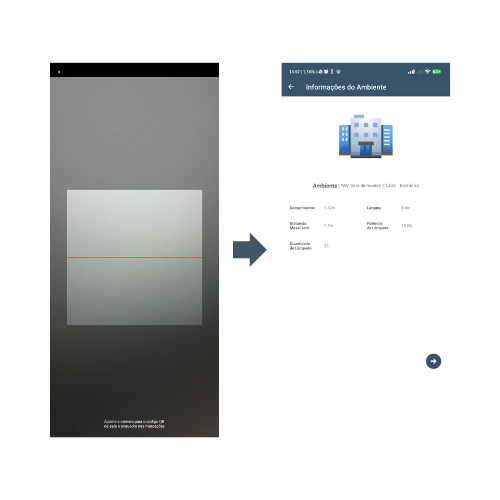
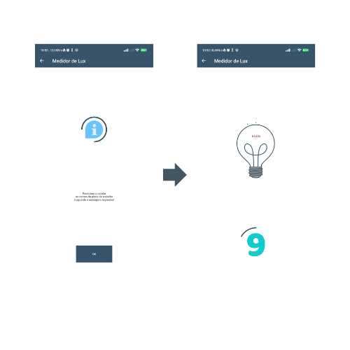
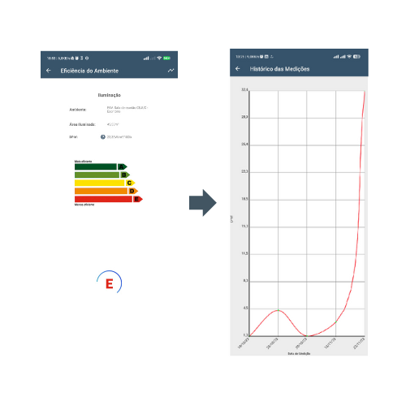

<center> 
    <h1>Projeto Eficiencia Energetica</h1>
</center>

***
Este repositório contém uma aplicação Backend e Mobile Android do Projeto de Eficiência Energética, desenvolvido em Node.js e Java, para a equipe da Justiça Federal de Teresina-PI.

## 🔋O que é o projeto?
* O projeto consiste em uma aplicação que tem como objetivo medir a eficiência energética de um ambiente, a partir da medição da luz no local.

## 📊Como é feita a classificação?
* A classificação é realizada com base na medição da luz ambiente, utilizando o sensor de luz de um aparelho Android.

***
# 🚀Execução Backend

> Observação: Atente-se em ter todas as ferramentas instaladas em sua maquina e caso algo seja alterado no Backend, deve-se fazer o deploy logo em seguida para aplicar as alterações.

1. Faça o clone desse repositorio rodando: <p>
```git clone https://github.com/Luiz-Eduardo-BL/Projeto-de-Eficiencia-Energetica.git``` </p>

2. Acesse a pasta ```cd ackend/functions``` do projeto no terminal e execute o comando: <p>
```npm install``` </p>

3. Execute o comando: <p>
```npm install -g firebase-tools``` </p>

4. Faça o login na conta Firebase executando o comando: <p>
```firebase login``` </p>

5. Execute o comando: <p>
```firebase init``` </p>
    Selecione usando as teclas "**Espace**" e "**Enter**", selecione as seguintes escolhas:
    * **Firestore**
    * **Functions**

6. Em Firestore Setup:
    * "What file should be used for Firestore Rules?" **firestore.rules**
    * "What file should be used for Firestore indexes?" **firestore.indexes.json**
    * "Would you like to initialize a new codebase, or overwrite an existing one? (Use arrow keys)" **Overwrite**
    * "What language would you like to use to write Cloud Functions?" **JavaScript**
    * "Do you want to use ESLint to catch probable bugs and enforce style?" **No**
    * "File functions/package.json already exists. Overwrite?" **No**
    * "File functions/index.js already exists. Overwrite?" **No**
    * "File functions/.gitignore already exists. Overwrite?" **No**
    * "Do you want to install dependencies with npm now?" **Yes**

7. Execute o comando: <p>
```firease deploy``` </p>

8. Copie o link de **Function URL** que é utilizado para as funçoes.

9. Altere o link nos locais especificos em [Leitor Planilha](/outros/leitorPLANILHA-JT.ipynb)
    * **Observe se as colunas da planilha são as mesmas do Leitor, pois podem ocorrer erros caso sejam diferentes.**

10. Execute o Leitor Planilha para carregar os dados no banco de dados e gerar o arquivo de QrCode.
    * **Atente-se para a necessidade de instalar as bibliotecas necessárias, além do Python, para a execução do Leitor Planilha.**

11. O Backend já é executado na nuvem. Para execução local, execute o comando: <p>
```npm run serve``` </p>

# 🚀Execução do Frontend

1. Alterar o endereço base da API dentro de [Api.java](/frontend/LuxMeter/app/src/main/java/moe/feo/luxmeter/Api.java)

2. Executar o projeto no Android Studio.

3. Na pasta **Build** encontra-se o [APK](/Build/Projeto-Eficiencia-Energetica.apk) para instalação.

***

## 📱Dispositivos usados para calibração

<ul>
    <li> <strong> Xiomi Poco M4 Pro - xiaomi-21091116ag </strong> </li>
    <li> <strong> Samsung Galaxy A10s - samsung-sm-a107m </strong> </li>
    <li> <strong> LG K8 Plus - lge-lm-x120 </strong> </li>
</ul>

***
<center>

## 📲 Telas de Execução do Aplicativo

### Tela Splash e Home


### Telas de Leitura do Qr-Code e Informações do Ambiente



### Tela de Informaçãos do uso do Aplicativo e Contagem Regressiva



### Tela de IResultados e Historico



</center>